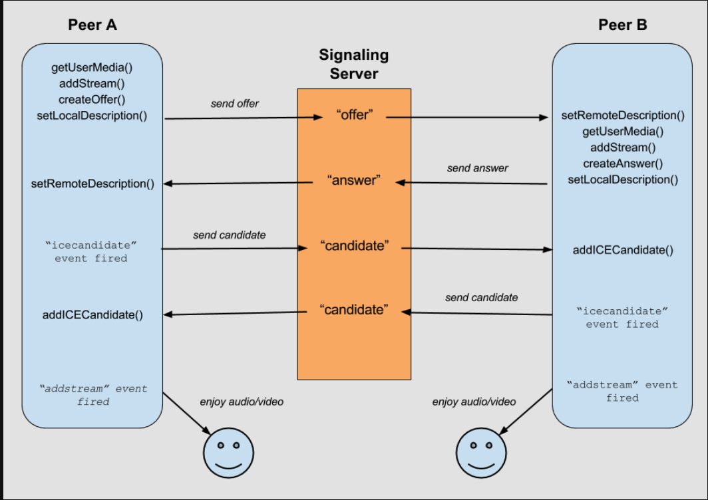

WEBRTC 이해하기 학습

1. SIP 엔지니어 블로그 - https://brunch.co.kr/magazine/understandsip
2. SIP의 구조 - https://brunch.co.kr/@linecard/130
3. overhead : 어떤 처리를 하기 위해 들어가는 간접적인 처리 시간, 메모리 등
   ex)  A라는 처리를 단순하게 실행한다면 10초 걸리는데,
   안전성을 고려하고 부가적인 B라는 처리를 추가한 결과 처리시간이 15초 걸렸다면,
   오버헤드는 5초가 된다. 또한 이 처리 B를 개선해 B라는 처리를 한 결과,
   처리시간이 12초가 되었다면, 이 경우 오버헤드가 3초 단축되었다고 말한다

- https://ko.wikipedia.org/wiki/%EC%98%A4%EB%B2%84%ED%97%A4%EB%93%9C

2. NAT : NAT는 사설IP를 공인IP로 필요한 주소 변환 서비스.(Network Address Translation)
3. WebRTC 구성 :
   https://eytanmanor.medium.com/an-architectural-overview-for-web-rtc-a-protocol-for-implementing-video-conferencing-e2a914628d0e
4. Sturn, Turn 서버 역활 : https://gh402.tistory.com/45
5. Stun 서버 구성 방법 :
   http://john-home.iptime.org:8085/xe/index.php?mid=board_sKSz42&document_srl=1546
6. PeerConnection 교환 과정

  

6. IOS document link :
   https://www.audiocodes.com/media/13477/webrtc-ios-client-sdk-api-reference-guide.pdf
7. 아파치 서버와 node.js 설정
8. webrtc github 저장소(간단한 사용법 부터 코덱, 볼륨 컨트롤)
   https://webrtc.github.io/samples/
9. 코덱에 관련한 정보(default : VP9 -> H264 변경할때)

- https://dom607.tistory.com/2 (개발시 코덱에 관한 경험과 코드 수정)

10. WebRTC 구현시 트랜스코딩이 필요 할 수 있다.
11. trun 서버 설치-coturn (설정파일 경로 : /usr/local/etc/turnserver.conf)
    설치관련 : https://highmaru.tistory.com/5
    config 파일 설정 관련 : https://gabrieltanner.org/blog/turn-server

12. Interactive Connectivity Establishment (ICE)
   Interactive Connectivity Establishment (ICE)는 브라우저가 Peer를 통한 연결이 가능하도록 하게 해 주는 프레임워크입니다. Peer A ➡️ Peer B까지 단순하게 연결하는 것으로는 작동하지 않는 것에 대한 이유는 많이 있습니다.
   연결을 시도하는 방화벽을 통과 해야하기도 하고, 단말에 Public IP가 없다면 유일한 주소 값을 할당해야할 필요도 있으며 라우터가 Peer 간의 직접 연결을 허용하지 않을 때에는 데이터를 릴레이 해야할 경우도 있습니다.
   ICE는 이러한 작업을 수행하기 위해서 위해서 설명하였던 STUN, TURN Server 두개 다 혹은 하나의 서버를 사용합니다.

13. WebRTC 관련 설명 잘되어 있는곳 
    https://42place.innovationacademy.kr/archives/8385
